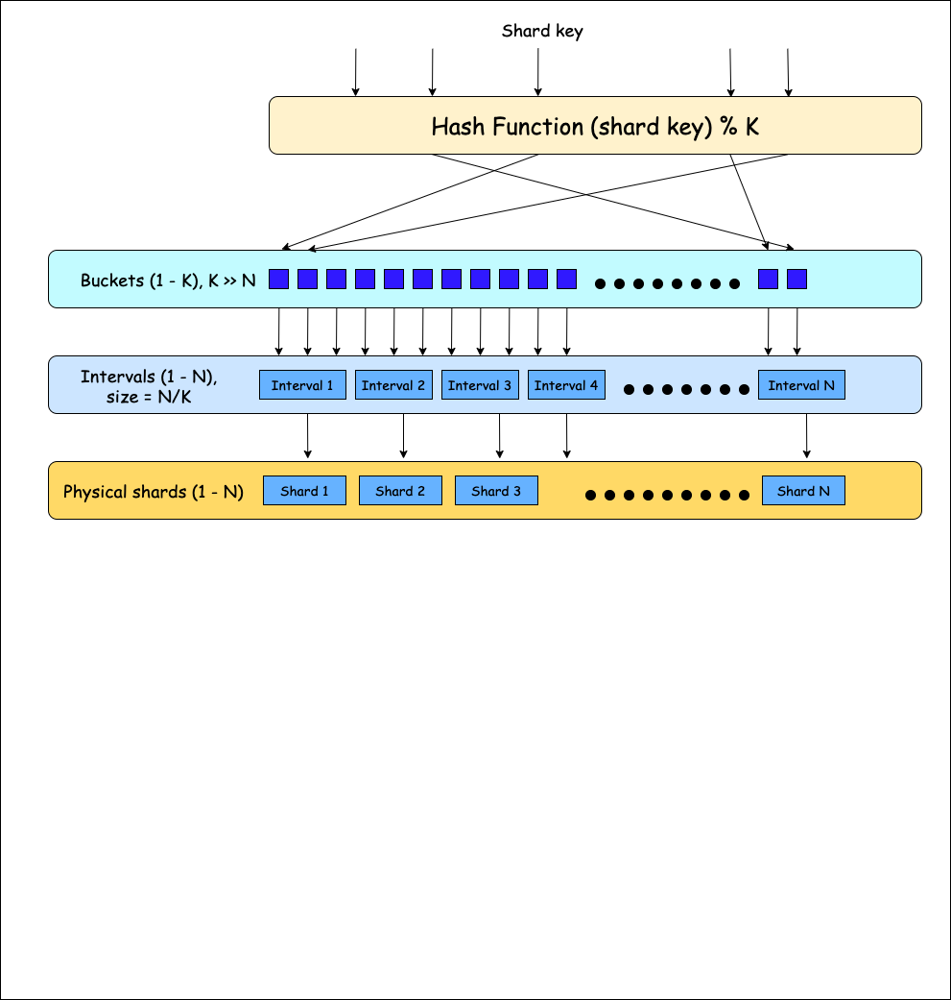

# Dropwizard DB Sharding Bundle

Application level sharding for traditional relational databases.
Apache Licensed

## Sharding logic

## Principle: Evenly distribute data irrespective of actual number of physical shards chosen by application owners.
Strategy:
 * Pick a hashing algorithm with good distribution characteristics for most inputs.
 * Pick a large bucket size. Sharding key will be hashed to one of these buckets as a first step.
 * Using a large bucket size is expected to distribute keys fairly evenly. Buckets are grouped together to form intervals with each interval mapping to a physical shard.
 This bucket to shard mapping is created at application startup time.

### Shard to bucket mapping
 * For purpose of evenly distributing data, a hashing algorithm is used to hash a key to one of a large number of buckets.
Current bucket size is **1024**.

* For Bucket count K, and Physical shards N, usually K >> N. Buckets are divided into intervals of size N/K and each interval is mapped one-to-one to a physical shard.

### Hashing algorithm for uniform sharding
**Hashing.murmur3_128()** from Guava library is used which yields a 128 bit value corresponding to the hashing key.
This value is converted to integer to get bucket and in turn physical shard to which value for the key will be saved and retrieved.

### What happens if an application owner decides to change the number of physical shards. For example from 16 to 32.
Resharding will be required to persist data to its new shard.

## DAOs
Daos are supposed to be objects to interact with datasource.
Dao classes in db sharding bundle are a layer above Hibernate. Daos interact with database via Hibernate session.

## Types of DAOs supported

### RelationalDao
 * A dao used to work with entities related to a parent shard. The parent may or maynot be physically present.
 * A murmur 128 hash of the string parent key is used to route the save and retrieve calls from the proper shard.

### LookupDao
 * A dao to save and retrieve top level entities in the system.
 * Entity persisted using LookupDao needs to have exactly one field annotated with @LookupKey. This field will
   be used as sharding key and hashed to right shard by same logic explained above.

### CacheableLookupDao
 * A read-through/write-through wrapper over LookupDao.
 * It has a simple cache interface ```LookupCache``` with essential methods.
 * Any custom cache implementation can be used to implement this cache and initialize ```CacheableLookupDao``` eg. Caffeine/Guava cache.

### CacheableRelationalDao
 * A read-through/write-through wrapper over RelationalDao.
 * It has a simple cache interface ```RelationalCache``` with more methods compared to LookupCache.
 * Any custom cache implementation can be used to implement this cache and initialize ```CacheableRelationalDao``` eg. Caffeine/Guava cache.

### FAQs about DAOs
#### If both RelationalDao and LookupDao use same logic of sharding based on a key, what is the difference between these two DAOs?
When to use which one?
This can be slightly confusing to a beginner!
RelationalDao is right choice for all entities that can be seen as children of same parent. While LookupDao
is right choice for an entity that doesn't seem to have parent-child relationship or sibling relationship with any other entity.

Example - If merchant is considered as parent entity, all entities such as merchant payment options,
merchant attributes, merchant preference info can be treated as children of this parent entity and persisted
using a RelationalDao. Using a relational dao indicates that these entities are related and should be colocated
on same shard to enable join/subselect queries etc.

But, another entity such as Agent table, which keeps info of agents who work on acquiring or helping multiple merchants, and are not related
to any other entity in merchant database, may use a LookupDao, since it is a TOP-LEVEL entity in the system.

#### What is the concept of parent key in RelationalDao?
One of the main requirements of sharding relational data is to colocate data for entities that might be
accessed or retrived together. For example, a merchant's profile, her store information, her payment options might be pulled together
in some flows, so it should be located on the same shard for a merchant M.
For this purpose, shard containing merchant M's primary profile info can be considered as parent shard and merchant's Id can be treated as parent key.
This parent key can be used for persisting related entities for the merchant using Relational Dao.

#### Is it necessary for different entities to use same parent key?
Only for related entities, it makes sense to pick and use same parent key.

#### Is sharding key specific to table or entire db?
Sharding key is required to shard an entity's data among different shards, it may have no relation in general
with any other entity. But, mostly entities are related to each other, so picking one sharding key/parent key
to persist a number of related entities helps to keep code predictable and maintainable.

#### What is alternative for persisting entity that is a root entity in itself and has no clear parent?
LookupDao can be used for this purpose. Unlike RelationalDao, LookupDao has the concept of LookupKey.
One of the fields in the entity can be annotated with @LookupKey annotation to use this field for saving and retrieving
entity. This field will be treated as hashing key with the Dao.

## Shard blacklisting
It is possible sometimes that one or more shards go bad due to a hardware or connectivity issue.
In that situation, that shard can be blacklisted, to keep service operational while shard is fixed
or shard endpoint is changed.

```ShardBlacklistingStore``` is an interface, which contains methods to:
 * blacklist a shard
 * unblacklist a shard
 * check if a shard is blacklisted

Since this library bundle will be part of an application with multiple boxes, it will be
easier to implement ```ShardBlacklistingStore``` as integration with a distributed cache or designated service which
will keep account of currently blacklisted shards for your backend service.

## Features
* Pagination support

*       Hibernate framework has in-built support for pagination.
        DBShardingBundle has wrapper methods which internally call pagination-supporting hibernate apis such as list(Criteria)
        Example - public List<T> select(String parentKey, DetachedCriteria criteria, int first, int numResults) throws Exception;

* Updating multiple rows at once - TBD


Please refer test classes to understand sample usage of daos.

## Usage
The project dependencies are:
```
<dependency>
    <groupId>io.appform.dropwizard.sharding</groupId>
    <artifactId>db-sharding-bundle</artifactId>
    <version>2.0.21-1</version>
</dependency>
```
# NOTE
- Package and group id has changed from `io.dropwizard.sharding` to `io.appfrom.dropwizard.sharding` from 1.3.12-3.
- static create* methods have been replaced with instance methods from 1.3.13-4
